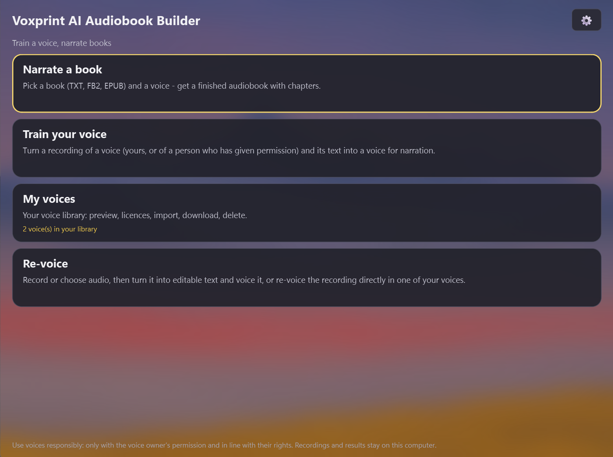
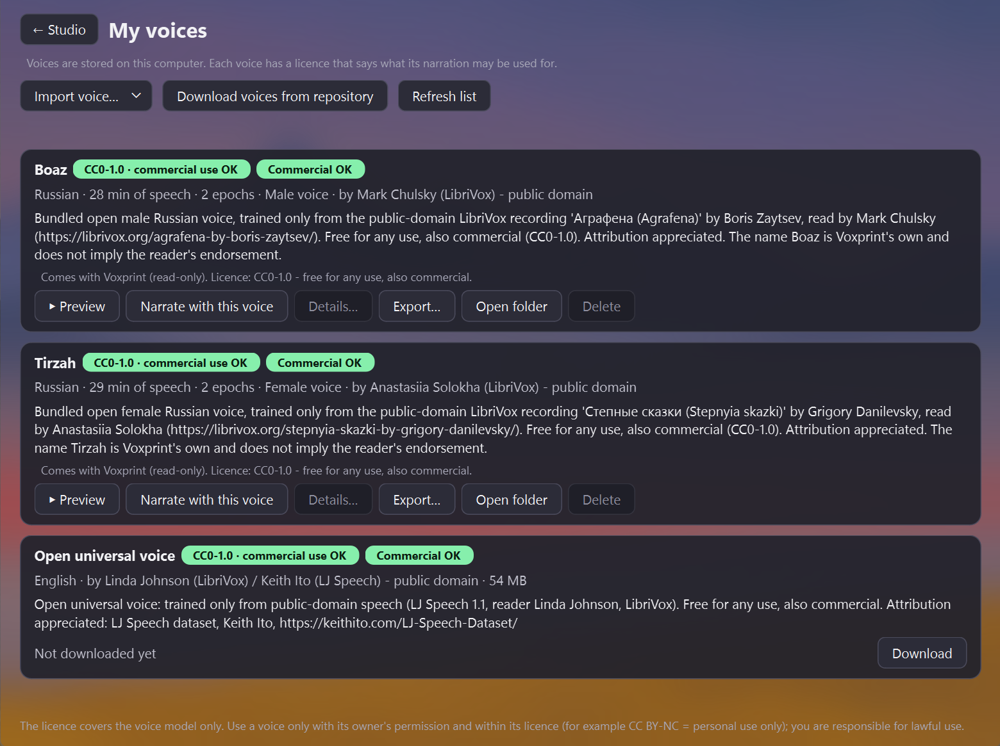
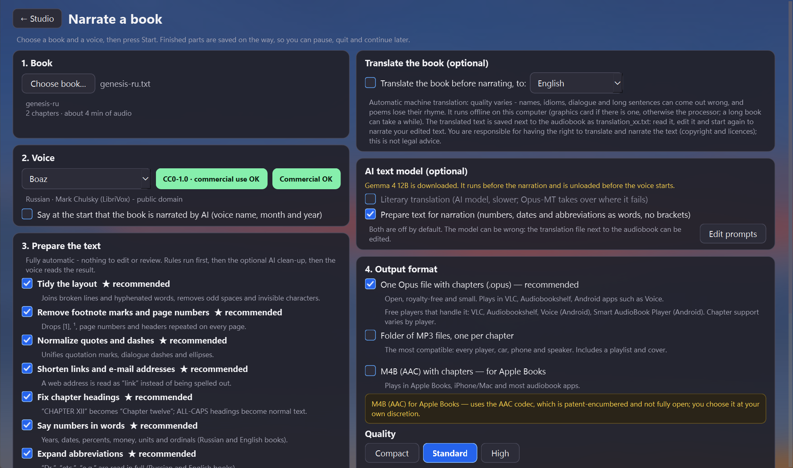
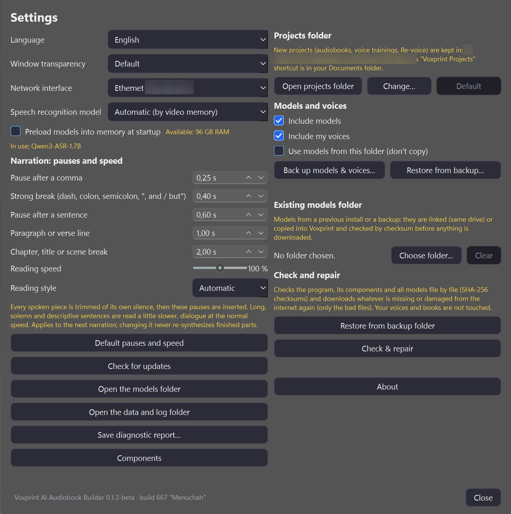

# Voxprint AI Audiobook Builder

**Train a voice from a short recording, then narrate whole books in it - offline, on your own computer.**

  

> **Beta / experimental (v0.1.3, build 667 "Menuchah").** The whole pipeline has run end to end on one machine (RTX 4090, Windows), but only one speaker was tested and settings may still change. Back up your recordings and voices, and report problems as issues. Needs **Windows 11 (24H2+) and an NVIDIA GPU** (16 GB VRAM recommended). Details: [tests and caveats](docs/TESTING.md).

 

 

## 🎙 Train your own voice: read one of these scripts
> **Recording scripts (EN / RU / DE)** - ready-made texts to read aloud when you record your voice for Voxprint. Read for **about 15 minutes** (plus 2-3 optional minutes), save the recording, give the app the TXT as the text - done. The **consent sentence** is built in at the end, no swear words.
>
> | English | Русский | Deutsch |
> |---|---|---|
> | [TXT](docs/recording-scripts/Voxprint-RecordingScript-v6-en.txt) · [PDF](docs/recording-scripts/Voxprint-RecordingScript-v6-en.pdf) · [print](docs/recording-scripts/Voxprint-RecordingScript-v6-en-print.pdf) | [TXT](docs/recording-scripts/Voxprint-RecordingScript-v6-ru.txt) · [PDF](docs/recording-scripts/Voxprint-RecordingScript-v6-ru.pdf) · [print](docs/recording-scripts/Voxprint-RecordingScript-v6-ru-print.pdf) | [TXT](docs/recording-scripts/Voxprint-RecordingScript-v6-de.txt) · [PDF](docs/recording-scripts/Voxprint-RecordingScript-v6-de.pdf) · [print](docs/recording-scripts/Voxprint-RecordingScript-v6-de-print.pdf) |
>
> Only record your own voice, or one whose owner agreed. More: [about the scripts](docs/recording-scripts/README.md).

## What it does
* **Narrate books** - TXT, FB2 (also `.fb2.zip`) and EPUB with chapters; output as one Opus file, MP3 per chapter or M4B; pause, cancel and resume at any time.
* **Pauses that follow the text** (new in 0.1.3) - the text is cut per sentence and at strong breaks, each spoken piece is trimmed of its own silence and measured pauses are inserted: comma 0.25 s, strong break 0.4 s, sentence 0.6 s, paragraph or verse line 1.0 s, chapter or scene break 2.0 s. Adjustable in *Settings -> Narration: pauses and speed* or with `voxprint narrate --pause-...`.
* **Reading speed that adapts to the text** (new in 0.1.3) - long, descriptive and scripture-like sentences are read a little slower, dialogue at the voice's own pace; a reading style per book (*Automatic*, *Solemn / scripture*, *Fiction*, *Dialogue-heavy*) and a global speed of 70-130 %. Applied after synthesis with the pitch kept, so changing pauses or speed never re-synthesizes finished parts.
* **Train your voice** - give it a 5-15 minute recording (yours, or of someone who agreed) and the text you read; everything else is automatic ([Qwen3-TTS](https://github.com/QwenLM/Qwen3-TTS) LoRA).
* **Offline translation** before narrating: Russian, English, German ([details](docs/TRANSLATION.md)).
* **Re-voice** a recording: turn it into editable text, or convert it directly into one of your voices ([details](docs/REVOICE.md)).
* **Open voice included** - *Tirzah* (female), Russian, **CC0-1.0** (free for any use, also commercial), trained only from a public-domain LibriVox recording; part of the standard model download and read-only in the library ([details](voices/BUNDLED.md)). Listen: [Genesis 1:1-2:3 with Tirzah](samples/genesis-tirzah.mp3) ([samples](samples/README.md)). *Boaz* shipped with 0.1.3 and is no longer installed. *Asher* and *Noa* are optional catalog voices, not part of that download ([voices](voices/README.md)).
* **Per-voice licences and consent** - every voice carries a licence and a usage scope; the UI shows whether commercial use is allowed ([voices](docs/VOICES.md)).
* **Resumable and safe** - downloads, narration and backups continue where they stopped; SHA-256 checks everywhere; *Check & repair* verifies every component and model file and re-downloads only the damaged ones.
* **Local and private** - no account, no telemetry; your recordings never leave the computer ([privacy](docs/PRIVACY.md)).
* UI in English, Deutsch, Русский, Українська and Latviešu; automatic text clean-up (numbers in words, abbreviations, footnotes) for Russian and English.

More: [all features and screenshots](docs/FEATURES.md) · [how it works](docs/HOW-IT-WORKS.md).

## Download
| Build | File | Size |
|---|---|---|
| **Online installer (Windows 11 x64, NVIDIA GPU)** | [`Voxprint-Setup-online.exe`](https://github.com/Mitroshenkov87/voxprint-audiobook-builder/releases/download/v0.1.3-beta/Voxprint-Setup-online.exe) | 35,235,971 bytes (about 34 MB, build 667 "Menuchah"; downloads the libraries from PyTorch/PyPI during setup) |

SHA-256: `c145a9fc84c736d655fbbe9bfd5c1cc94794b1be7fb8e9a5eec293e6f1578e42` - release page: [v0.1.3-beta](https://github.com/Mitroshenkov87/voxprint-audiobook-builder/releases/tag/v0.1.3-beta) (pre-release). The installer is **not code-signed**: Windows SmartScreen will warn - choose *More info -> Run anyway* only after the SHA-256 matches ([how to check](docs/DOWNLOADS.md)). Setup type **Full** (default) downloads all models (about 28 GB with the components) on the first start; **Quick** installs only the program and offers the same download in the Components window.
A full offline installer may return later; the Linux version is temporarily unavailable.

## Quick start
1. Install and start Voxprint - the **Studio** opens. Under *Train your voice* choose your recording and the text you read, press **Create voice (LoRA)**.
2. Open *Narrate a book*, choose a TXT / FB2 / EPUB file and your voice (optionally tick *Translate the book*).
3. Press **Start narration** and listen while the rest is being made. The audiobook lands in the projects folder (`%LOCALAPPDATA%\Voxprint\Projects\Audiobooks`, shortcut *Voxprint Projects* in Documents).

## Documentation
* **User manual (PDF, 0.1.3 build 667):** [English](docs/manual/Voxprint-Manual-en.pdf) · [Русский](docs/manual/Voxprint-Manual-ru.pdf) · [Deutsch](docs/manual/Voxprint-Manual-de.pdf) (print versions and sources: [`docs/manual/`](docs/manual/); screenshots: [`docs/screenshots/en-667/`](docs/screenshots/en-667/))
* **Recording scripts** to read when you record a voice (ru / en / de, TXT + PDF): [`docs/recording-scripts/`](docs/recording-scripts/)
* [User guide](docs/USER-GUIDE.md) · [Command-line interface](docs/CLI.md) · [Driving the app (for agents)](docs/AGENTS.md) · [FAQ](docs/FAQ.md) · [Translation](docs/TRANSLATION.md) · [Re-voice](docs/REVOICE.md) · [Voices and licences](docs/VOICES.md) · [AAC / M4B notice](docs/AAC-M4B.md)
* [Models, mirrors and backups](docs/MODELS.md) · [Downloads and hashes](docs/DOWNLOADS.md) · [Linux](docs/LINUX.md) · [Building and contributing](docs/BUILDING.md)
* [How it works](docs/HOW-IT-WORKS.md) · [Voice quality](docs/VOICE-QUALITY.md) · [Architecture](docs/ARCHITECTURE.md) · [Tests and verification](docs/TESTING.md) · [Roadmap](docs/ROADMAP.md) · [Changelog](CHANGELOG.md)

## Licence and credits
Source code: **Apache License 2.0** ([`LICENSE`](LICENSE), [`NOTICE`](NOTICE)). Models and voices keep their own licences - see [docs/LICENSES.md](docs/LICENSES.md). Terms of use (End User Agreement, not legal advice): [docs/legal/](docs/legal/EULA-audiobook-builder.md). Open-source components and credits: [`THIRD_PARTY_NOTICES.md`](THIRD_PARTY_NOTICES.md).

*Independent, non-commercial project by Aleksandr Mitroshenkov; not affiliated with any product or company with a similar name ("VoxPrint"/"Voxprint").*
Use voices only with the owner's permission.

Contributing: [CONTRIBUTING.md](CONTRIBUTING.md) · [AGENTS.md](AGENTS.md) (for AI coding agents).

## Reusable parts
A few large pieces can be copied on their own. Each file's docstring says what it does, how to call it, and how to credit Voxprint. Small helpers are not listed.

* [`core/yo.py`](core/yo.py) - Russian letter yo, only where the dictionary is sure. Data: [`core/data/`](core/data/YO_DATASET.md).
* [`core/speakers.py`](core/speakers.py) - paragraph speaker marks (narrator, male, female) and the reply parser.
* [`infra/model_downloader.py`](infra/model_downloader.py) - resumable, hash-checked model downloads.

## ☕ Support the Project

If you find this project useful and would like to support its development, you can buy me a coffee!

- **Network:** TRON (TRC-20)
- **Accepted:** USDT or TRX
- **Address:** `TYveZBXaSpM4FEHa6iGrc7A6zuLfS4z3x6`

> ⚠️ **Important:** Please ensure you are sending funds **only** via the TRON (TRC-20) network. 
> Sending assets from other networks (such as Ethereum ERC-20, BSC BEP-20, etc.) to this address will result in **permanent loss of funds**.
