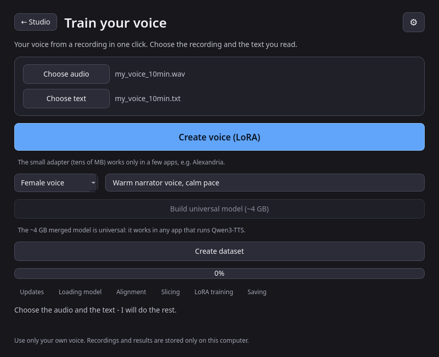
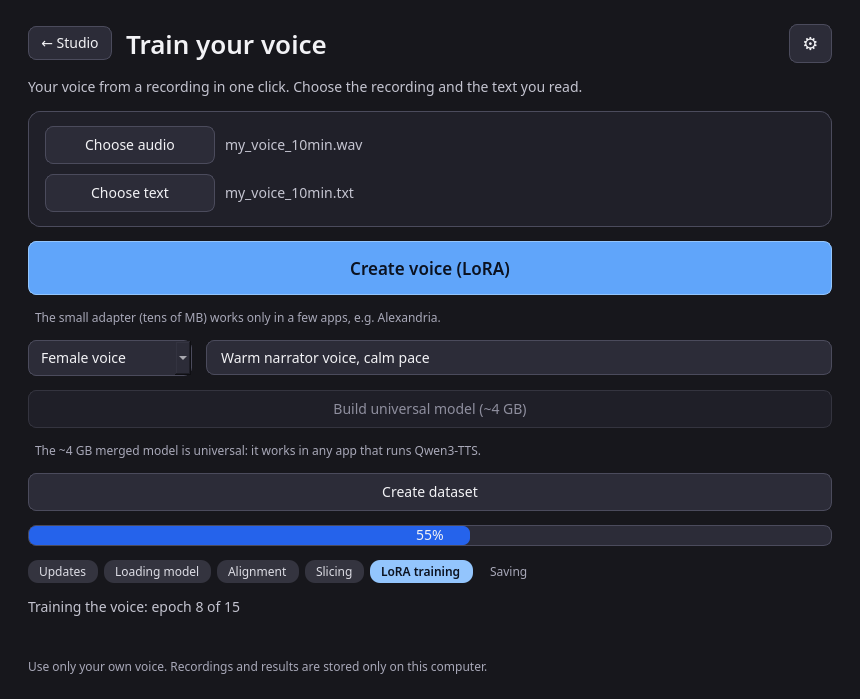
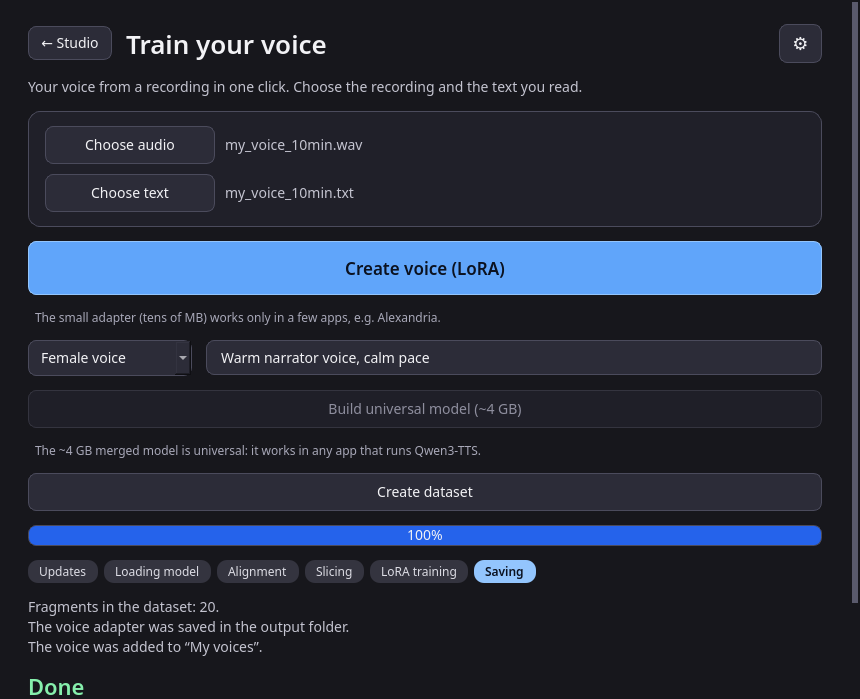
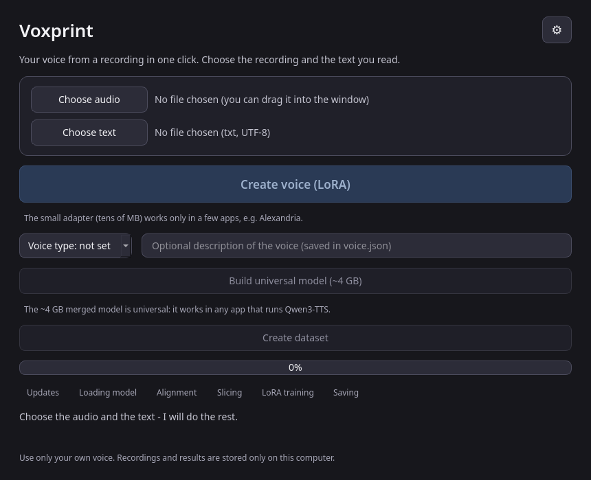
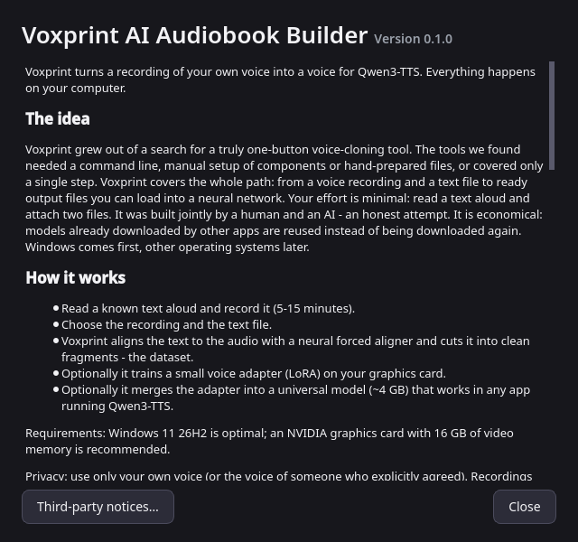
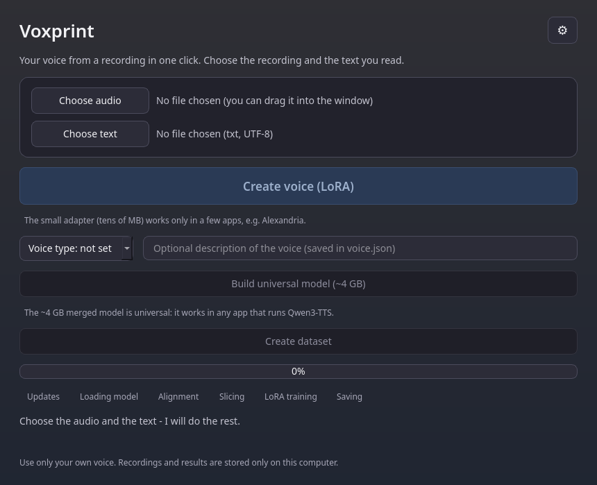
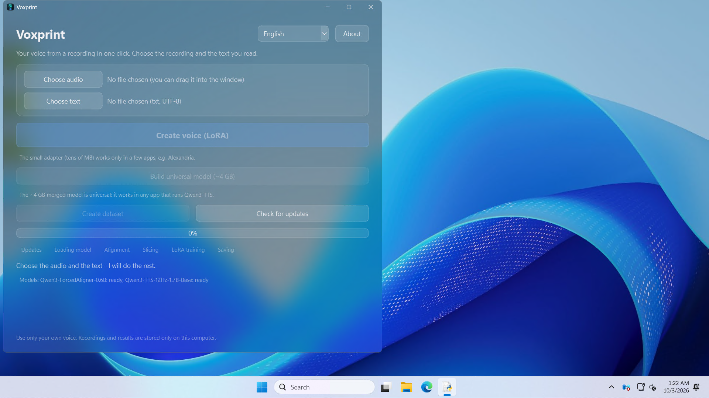
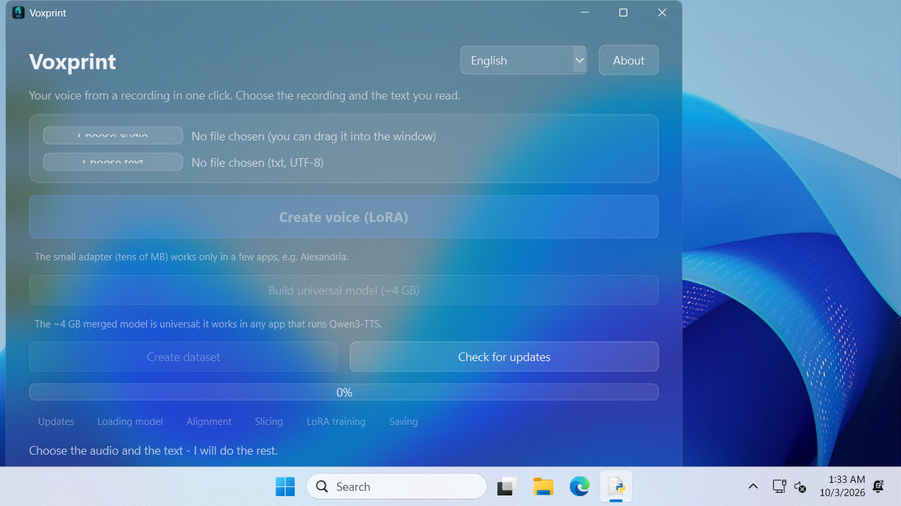

# Voxprint

**Your voice from a recording in one click.** Give Voxprint a 5-15 minute recording of your own voice and the text you read:
it aligns the text to the audio, cuts a training dataset, trains your voice as a LoRA adapter for
[Qwen3-TTS](https://github.com/QwenLM/Qwen3-TTS) and, if you want, merges it into a standalone model that works in any
app that runs Qwen3-TTS. A native Windows 11 window - no command line, no browser, no Gradio, no WSL.

<p align="center"></p>

> **Requires Windows 11 (24H2 / build 26100 or newer) and an NVIDIA GPU (16 GB VRAM recommended).**
> Without an NVIDIA GPU the dataset is still created, but voice training falls back to the CPU (very slow, with a warning).
> The code itself also runs on Linux (that is where the test-suite runs); a Linux/macOS GUI release is not a goal yet.

> **Status: early (0.1.0).** The whole pipeline was exercised on a real RTX 4090 / Windows Server 2025 machine (see
> [Tested on Windows](#tested-on-windows)), but there has been no public release yet and voice *quality* has not been
> judged by ear. Expect rough edges.

## Contents
[Concept](#concept-and-philosophy) · [Features](#features) · [Screenshots](#screenshots) · [Installation](#installation) ·
[Using Voxprint](#using-voxprint) · [How it works](#how-it-works) · [Output format](#output-format) ·
[Hardware requirements](#hardware-requirements) · [Model reuse](#reusing-what-is-already-on-your-computer) ·
[Tested on Windows](#tested-on-windows) · [Privacy](#privacy) · [Roadmap](#roadmap) · [Contributing](#contributing) ·
[Licences](#licences-and-third-party-components)

## Concept and philosophy
Voxprint grew out of a search for a truly **one-button voice-cloning tool**. The tools we found needed a command line,
manual setup of components or hand-prepared files, or covered only a single step. Voxprint covers the **whole path** - from a
voice recording and a text file to ready output files you can load into a neural network. Your effort is minimal:
**read a text aloud and attach two files.**

* **One button, no expertise.** Hyper-parameters, model sizes, chunking and cleaning are chosen automatically for your GPU.
* **Economical.** Models and tools that other apps (Hugging Face cache, Pinokio/Alexandria, ModelScope) already downloaded are reused
  in place, read-only - nothing is downloaded twice, nothing of other apps is touched.
* **Honest and verifiable.** Package versions and model revisions are pinned to a "verified by Voxprint" set; failures produce stable,
  localized messages instead of tracebacks; every claim in this README is backed by a test or a documented real run.
* **Private by design.** Everything runs on your computer (see [Privacy](#privacy)).
* **Windows first**, other platforms later. Built jointly by a human and an AI - an honest attempt.

## Features
* Forced alignment of your text onto the recording with `Qwen/Qwen3-ForcedAligner-0.6B` (+ optional CTC backup aligner);
  long recordings are cut at pauses and aligned in chunks.
* Automatic **dataset in the Alexandria `train_lora.py` format**: 3-12 s clips cut at pauses (never mid-word), a clean reference
  clip, `metadata.jsonl`, a report. Bad fragments (clipping, silence, noise) are dropped automatically.
* Russian text normalization (numbers, abbreviations are spelled out) before alignment; UTF-8 / cp1251 text input; WAV, FLAC, MP3, M4A, OGG ... audio input.
* **LoRA voice training** with the Alexandria recipe (r=32, alpha=128 on the talker), parameters chosen from your VRAM
  (1.7B or 0.6B base, 8-bit Adam, CPU fallback, automatic retry plan after out-of-memory).
* Optional **universal model** (~4 GB, `custom_voice` format) merged from the adapter - works in any Qwen3-TTS app.
* **`voice.json`** next to the adapter: voice name, language, creation date, speech duration, epochs, base model and (optional) voice type and description.
* **Settings** dialog (gear): language (English, Deutsch, Русский), update check, model/data folders, repair, About.
* Scrollable window that stays usable on small screens (e.g. 1366x768 at 150% scaling).
* Safe self-maintenance: verified-version updates with staging + smoke test + rollback, a repair command, a completion manifest.
* Acrylic (glass) look on Windows 11 with a dark, high-contrast (WCAG AA) theme and a plain fallback.

## Screenshots
All screenshots are English-UI renders of the current theme (offscreen Qt; see `docs/screenshots/`).

| Choose files | Running | Done |
|---|---|---|
|  |  |  |

| Idle | Settings (gear) | About |
|---|---|---|
|  |  |  |

Acrylic preview - the translucent window with its strong dark tint, composited over a deliberately bright desktop (the worst case for contrast):

<p align="center"></p>

Real desktop screenshots from the Windows test run (Windows Server 2025, taken *before* the darker, more opaque theme - the current look is the one above):

| 1920x1080 at 125% | 1366x768 at 125% |
|---|---|
|  |  |

## Installation
There is no public release yet. Planned installer channels are listed in the [Roadmap](#roadmap). Today you have two options.

### Option 1: the installer (built locally)
`build.bat` produces `installer\Output\Voxprint-Setup.exe` (Inno Setup 6, per-machine install, Windows 11 x64; about 1.8 GB because PyTorch is inside).
The installer does not contain the models: on first start Voxprint downloads about 7 GB once (internet needed).

### Option 2: run from source (Windows)
```bat
py -3.11 -m venv .venv && .venv\Scripts\activate
pip install uv
uv pip install torch torchaudio --torch-backend=auto       :: fallback: pip install -r requirements-torch.txt
uv pip install -r requirements.txt -r requirements-verified.txt
uv pip install --no-deps -r requirements-nodeps.txt        :: qwen-asr/qwen-tts: their transformers pins conflict
python -m bitsandbytes                                     :: optional check of the 8-bit optimizer (plain AdamW otherwise - fine)
python main.py
```
**Never run `uv run` without `--no-sync`** - it re-syncs the environment and replaces CUDA torch with the CPU build. flash-attn is not needed on Windows.

### Build the installer yourself
```bat
build.bat              :: venv + torch (uv, CUDA auto-detect) + dependencies + notices + tests + dist\Voxprint.exe (--onefile) + installer if Inno Setup 6 exists
build.bat onedir       :: dist\Voxprint\ folder (preferred: faster start, and Qt/PySide6 stay replaceable - see Licences)
:: quick rebuild:  set VOX_SKIP_TESTS=1 & set VOX_SKIP_INSTALLER=1 & build.bat onedir
:: verify a frozen build contains every library:  dist\Voxprint\Voxprint.exe --selftest-imports   (result in <app home>\logs\selftest_imports.txt)
```
Command-line maintenance flags of `main.py`: `--prefetch` (download models now), `--selftest`, `--selftest-imports`, `--verify-install`, `--repair`.
App data lives in `%LOCALAPPDATA%\Voxprint` (`models\`, `logs\`, `state\`, ...; override with `VOXPRINT_HOME`).
Interface language override: `VOXPRINT_LANG=en|de|ru`.

## Using Voxprint
1. Press **Choose audio** and **Choose text** (or drag the files into the window). The text is a UTF-8 `.txt` of what you read.
2. Optional, under the main button: pick a **voice type** (male / female / child / other) and type a short **description** - both are saved in `voice.json`.
3. Press **Create voice (LoRA)** - everything else is automatic. When it finishes, the folder opens:
   `...\<recording name>_Voxprint\dataset` (the dataset) and `...\output\<voice name>` (the small adapter, tens of MB).
   **Create dataset** builds only the dataset.
4. Optional: **Build universal model (~4 GB)** merges the trained adapter into a standalone model in `...\output\<voice name>\merged_model`
   (Qwen3-TTS `custom_voice` format; the voice is `speaker=<voice name>`). The small adapter works only in a few apps (e.g. Alexandria);
   the merged model works in any app that runs Qwen3-TTS. Voxprint checks the free disk space and asks for confirmation first; the big model is never built automatically.
5. The **gear** button opens **Settings**: language, *Check for updates* (also checked weekly in the background), open the models / data & log folders,
   *Repair the installation*, and *About* (help, authors, open-source components with their licences, third-party notices).

Use only your own voice (or the voice of someone who explicitly agreed).

## How it works
```
 audio + text
     │  read + normalize (numbers/abbreviations spelled out, UTF-8/cp1251)
     ▼
 forced alignment ── Qwen3-ForcedAligner (long audio: cut at pauses, chunks ≤ 150 s, text split by clauses)
     │  word timestamps
     ▼
 slicing ── 3-12 s clips cut at pauses, never mid-word, + ~1 s trailing silence
     ▼
 quality filter ── drops clipped / silent / noisy clips (adaptive if too many are rejected)
     ▼
 dataset (Alexandria format) ──► LoRA training on the Qwen3-TTS talker ──► adapter + voice.json
                                                                              │ optional
                                                                              ▼
                                                                   merged "universal" model (~4 GB)
```
Heavy work runs in background threads (`workers/`); the UI only reacts to progress signals. Before anything else a quiet weekly update
check runs (it never changes components in *your* environment without asking). See [`docs/ARCHITECTURE.md`](docs/ARCHITECTURE.md) for the module map and data flow.

Hyper-parameters are chosen automatically (Alexandria `lora.md`): LoRA r=32, alpha=128 on q/k/v/o_proj of the **talker**, batch 1 with
accumulation 4-8, lr 1e-6 (< 90 fragments) or 2e-6, epochs ~ 320 / fragments, eager attention, bf16, gradient checkpointing; a warning is
shown if the final loss is < 3.5 (the threshold is not confirmed for Russian).

## Output format
Alexandria `train_lora.py` contract:
```
dataset\  metadata.jsonl  {"audio":"segment_001.wav","text":"...","ref_audio":"ref.wav"}  (UTF-8, relative paths)
          segment_NNN.wav (24 kHz mono, 3-12 s of speech + ~1 s trailing silence, cuts at pauses, never mid-word)
          ref.wav (24 kHz, 5-10 s, the cleanest fragment)   ref_text.txt (exact transcript of ref.wav)
          report.json (incl. text_raw - the original text before normalization, quality drops, training language)
output\<voice name>\  adapter_model.safetensors, adapter_config.json, ref_sample.wav, training_meta.json, voice.json
          checkpoints\epoch_NN\ (adapter copy after every epoch; may be deleted)
          merged_model\ (only after "Build universal model": model.safetensors bf16 ~4 GB, config.json with
          tts_model_type=custom_voice + talker_config.spk_id, speech_tokenizer\, ref_sample.wav, ref_text.txt,
          speaker_embedding.safetensors, voxprint_voice.json, USAGE.txt)
```
`voice.json` (schema 1) example:
```json
{"schema": 1, "voice_name": "my_voice", "language": "russian", "created": "2026-10-03T12:00:00Z",
 "speech_seconds": 412.7, "epochs": 15, "base_model": "Qwen/Qwen3-TTS-12Hz-1.7B-Base",
 "voice_type": "female", "description": "Warm narrator voice, calm pace"}
```
`voice_type` (`male|female|child|other`) and `description` (whitespace collapsed, ≤ 500 characters) are optional: when you leave them empty they are written as empty strings. The other fields are filled in automatically.

Using the merged model: `Qwen3TTSModel.from_pretrained(folder).generate_custom_voice(text, language="Russian", speaker="<voice name>")`.

## Hardware requirements
| | Minimum | Recommended |
|---|---|---|
| OS | Windows 11 24H2 (build 26100) x64 | Windows 11 26H2 |
| GPU | NVIDIA with ~6 GB VRAM (0.6B model, 8-bit Adam) | NVIDIA with 16 GB VRAM (1.7B model); a 4090 peaked at 6.1 GB whole-GPU usage for a 170 s recording |
| Without NVIDIA | dataset only; training on the CPU is possible but very slow | - |
| Disk | ~12 GB (models ~7 GB, program 3.6 GB installed) + ~4.2 GB for the optional universal model | SSD |
| Network | needed once for the model download (Hugging Face, or the ModelScope mirror) | - |
| Driver | NVIDIA driver with CUDA 11.8+ (PyTorch flavor cu118-cu130 is picked from `nvidia-smi`) | current driver |

The VRAM tiers used by the planner: >= 14 GB -> 1.7B; >= 10 GB -> 1.7B + 8-bit Adam; >= 6 GB -> 0.6B + 8-bit Adam; otherwise CPU.

## Reusing what is already on your computer
Before downloading a Qwen model Voxprint looks for a complete copy left by another app and uses it **in place - read-only, nothing
is copied, moved, changed or deleted** (`core/model_locator.py`). Where it looks (confidence: high = verified in code/docs, medium = derived, not checked on a real install):

| Source | Location | Confidence |
|---|---|---|
| Standard Hugging Face cache (also what **Alexandria** uses) | `$HF_HUB_CACHE`, else `$HF_HOME/hub`, else `$XDG_CACHE_HOME/huggingface/hub`, else `~/.cache/huggingface/hub` (Windows: `%USERPROFILE%\.cache\huggingface\hub`); layout `models--Qwen--<Name>/{blobs,refs/main,snapshots/<sha>}` | high |
| Alexandria installed via **Pinokio** (Pinokio sets `HF_HOME=./cache/HF_HOME`) | `<pinokio>\api\alexandria-audiobook.git\cache\HF_HOME\hub` (folder name inferred, so `api\*\cache\...` is scanned), or `<pinokio>\cache\HF_HOME\hub` | medium |
| Alexandria in Docker | volume inside Docker - not reachable from the host (use `VOXPRINT_MODEL_DIRS` with a bind mount) | high |
| ModelScope cache | `%MODELSCOPE_CACHE%` or `~/.cache/modelscope`, then `hub/models/<Owner>/<Name>` (dots in the name become `___`) | medium |
| Manual downloads (`--local_dir`) | `~/models`, `./models`, the working folder: `<Name>`, `<Owner>/<Name>`, `<Owner>--<Name>`; a previous Voxprint install | medium |
| Your own list | `VOXPRINT_MODEL_DIRS` (paths separated by `;` on Windows) - searched first. `VOXPRINT_NO_EXTERNAL_MODELS=1` switches reuse off | - |

A copy is accepted only if it is **complete** (valid `config.json`, every file of the repository incl. `speech_tokenizer/`, consistent and non-truncated
`*.safetensors`, all shards, resolvable symlinks, no `*.incomplete`) and matches the **verified revision** from `infra/verified_manifest.json`
(HF snapshot folder name = commit sha; folders without a sha are accepted only when the weight-file sizes equal the verified commit).
On a mismatch the verified revision is downloaded. The updater never touches reused copies.

**Download mirror.** If Hugging Face is slow or unreachable (6 s probe; skipped when you set your own `HF_ENDPOINT`) or fails, Voxprint downloads from
**ModelScope** (modelscope.cn, org `Qwen`; same repository ids, byte-identical file sizes - verified 2026-10-03) and confirms the revision by file sizes.
Downloads resume after an interruption. `VOXPRINT_NO_MIRROR=1` disables the mirror.

**Components.** The same idea applies to Python packages and tools (`infra/env_probe.py`, read-only): installed and current / proven compatible -> reused;
missing -> the newest verified version is installed into **Voxprint's own environment** (its venv / `packages/` overlay), which is auto-updated.
An *outdated component in your own environment* (system Python, Pinokio, conda) is **never touched silently**: a one-click prompt offers to upgrade it
and says exactly what changes. *Upgrade* -> pip upgrades it there (smoke-tested, rolled back on failure); *Not now* and still compatible -> used as is;
*Not now* and too old -> Voxprint uses its own copy and your environment stays untouched. torch: any build is reusable, but its CUDA flavor must fit the driver.
ffmpeg: a system one is used only if `ffmpeg -version` works, otherwise a pinned LGPL build (sha256, staging, smoke test, atomic swap, rollback).
**Unsloth is deliberately not used**: as of 2026-10-03 it has no Qwen3-TTS fine-tuning support and its dependency pins conflict with the verified set;
Voxprint trains with its own LoRA loop.

## Tested on Windows
Real run on **Windows Server 2025 + NVIDIA RTX 4090** (driver 610.88 / CUDA 13.3, Python 3.11.9, torch 2.14.1+cu130), 2026-10-03.
The 4090 has 22.5 GiB; the app was tested against a 16 GiB cap to emulate a 16 GB laptop GPU.

| Area | Result |
|---|---|
| Test-suite on Windows | **236 passed, 1 skipped** (2 Windows-only failures found and fixed) |
| Install (Python, Inno Setup, venv, torch cu130, dependencies) | passed, about 2:50 with `uv`; silent installer run 88 s |
| Model download (Hugging Face) | aligner 34 s, TTS-1.7B 58 s; reuse from another app's HF cache: 0 files copied |
| Pipeline A - SAPI voice, English, 170.6 s | 20 segments, 154.9 s kept, 0 dropped; LoRA r=32, 15 epochs: **112 s** (~7.5 s/epoch); peak VRAM **5.18 GiB** (torch) / **6.13 GiB** (whole GPU); adapter **58 MB**; merged export **13 s, 4.21 GiB** |
| Pipeline B - LibriSpeech, 293 s, unpunctuated text | 30 segments (5.4-10.8 s), 721 of 721 words used; cut-edge error mean 0.33 s (start) / 0.24 s (end); 11 epochs in 130 s |
| ASR round trip (Qwen3-ASR-0.6B) on generated speech | 2 of 2 sentences transcribed exactly (WER 0) |
| Adapter loading | `PeftModel.from_pretrained` + voice-clone generation works; merged model generation works |
| Build | PyInstaller onedir 3.59 GiB; installer 1.83 GiB; full `build.bat` about 16 min |
| Installer | silent install, installed exe `--selftest-imports` and `--selftest` OK, uninstall in 4 s |
| `--verify-install` / `--repair` | passed after two fixes (idempotent) |
| Input formats | mp3 passed; m4a passed after a fix; Russian text handling (UTF-8/cp1251, normalizer) passed |
| GUI as a normal window | verified at 1920x1080 at 100/125/150% and 1366x768 at 125% |

**Not verified (honest caveats):** voice *similarity/quality by ear* was not judged (the loss stays above 3.5 with few epochs; the ASR check proves
intelligibility only); real **Russian** audio through alignment and training was not run (only English audio; Russian is verified for text handling);
a long training run started from the GUI and the frozen exe's full pipeline were not exercised; loading the adapter in Alexandria with its own pinned
peft was not tested; the ModelScope fallback and the pinned LGPL ffmpeg download were not re-tested after a certificate fix; the 8-bit optimizer was not used in training.
Cosmetic: the `sox` package prints a "SoX could not be found" notice on import; the exe has no version info yet.

The Linux test-suite (`QT_QPA_PLATFORM=offscreen python -m pytest`) covers the pipeline with synthetic audio and a tiny randomly initialised model.

## Privacy
**Use only your own voice, or the voice of someone who explicitly agreed.** Recordings, text and the finished voice stay on your computer.
Voxprint sends nothing to the internet except: downloading models (Hugging Face, or the ModelScope mirror), checking PyPI / the Hugging Face API for
updates, and (only if you accept an offer) installing packages. There is no telemetry and no account. A notice is shown on first start and a reminder
sits at the bottom of the window. Logs (`%LOCALAPPDATA%\Voxprint\logs`) stay local too.

## Roadmap
Ideas, not promises:
* **Audiobook Studio** - a second module that uses your trained voice to read whole books (chapters, queue, export to common audio formats).
* **Translation** - translate a text and speak it in your own voice in another language.
* **Multi-voice markup** - mark up a text with several speakers / voices and render them in one pass.
* **Android** - later: convert the merged model for phones (GGUF / LiteRT; today the merged folder is a plain Hugging Face directory a converter can start from).
* **Installer channels** - *online* (small installer, downloads components), *offline* (everything included), and *beta* (pre-releases).
* English and German installer wizard texts (the current Inno Setup wizard is Russian-only), a public repository URL and a published licence for the Voxprint source code.
* More languages in the UI (see "Adding a language" below) and Linux/macOS builds.

## Contributing
Contributions are welcome - see [`CONTRIBUTING.md`](CONTRIBUTING.md) (setup, tests, code style, localization, how to propose changes) and
[`docs/ARCHITECTURE.md`](docs/ARCHITECTURE.md) (module map, data flow). Quick start for developers:
```bash
python -m venv .venv && . .venv/bin/activate        # Linux: enough to run the tests
pip install -r requirements.txt -r requirements-verified.txt -r requirements-dev.txt
pip install --no-deps -r requirements-nodeps.txt
QT_QPA_PLATFORM=offscreen python -m pytest          # ~250 tests, no GPU, no network
python -m core.cli audio.wav text.txt --out dataset --fake-aligner     # dry run of the pipeline without a neural network
```
CLI for stage-by-stage checks on a GPU machine: `python -m core.cli audio.wav text.txt --out dataset [--language Russian] [--device cuda] [--train --output-dir output]`.
Regenerate the notices after editing `credits.json`: `python tools/gen_notices.py` (a test checks they are in sync).

### Localization
Supported UI languages: **English (default), German, Russian**. Catalogs are flat JSON files `locales/{en,de,ru}.json` (`"ui.start": "...{name}..."`);
`core/i18n.py` provides `tr(key, **params)`. Language order: `VOXPRINT_LANG`, saved choice (`state\language`), Windows user locale, English. A system language that
is not supported (e.g. Ukrainian) falls back to English. Tests check that all catalogs have identical keys and placeholders and that no user-facing literals are left in the code.

#### Adding a language
Ukrainian and Belarusian were dropped on purpose (fewer languages to keep in sync); their last complete catalogs are in git history
(`git show cdea827:locales/uk.json`, `...be.json`; component texts in `git show cdea827:credits.json`). To add a language `xx`:
1. `core/i18n.py`: append `"xx"` to `LANGS` and its own-language name to `LANG_NAMES` (the language switcher and the system-locale mapping `normalize_code` are driven by these two).
2. `locales/xx.json`: copy `en.json` and translate all values; keep every key and every `{placeholder}` (a test enforces both).
3. `credits.json`: add an `"xx"` text to every `purpose` (and `note`) entry - the credits test requires all `LANGS`.
4. Run `python -m pytest` - the parity tests (`tests/test_i18n.py`, `tests/test_credits.py`) and the per-language UI tests iterate over `i18n.LANGS`; update the
   places that count languages (the switcher test in `tests/test_i18n.py` and the `len(seen) == 3` checks in `tests/test_env_install.py` / `tests/test_model_locator.py`).
5. Mention it in this README.

### Repository link
The GitHub URL lives in one place: `"repo_url"` in `credits.json` (read as `core.appinfo.REPO_URL`). While it still contains the placeholder `OWNER`
the link is hidden in **About**; replace it with the real URL and the button appears.

### Versions: "verified by Voxprint"
`infra/verified_manifest.json` pins the package versions and model revisions (HF commit shas) Voxprint was tested with. The updater installs exactly those
(rolling back if needed: `restore_verified()`) and merely logs newer PyPI releases as "not verified yet". Channel "latest": `VOXPRINT_CHANNEL=latest`
(or `{"channel":"latest"}` in `state\updater_state.json`). `requirements-verified.txt` / `requirements-nodeps.txt` are generated from the manifest
(`python -m infra.verified_manifest [--nodeps]`; a test keeps them in sync).

## Licences and third-party components
Voxprint stands on open-source software; the single source of truth is `credits.json`. From it come the **About** list, `THIRD_PARTY_NOTICES.md`
(shipped by the installer together with the `licenses\` folder of full licence texts) and the build-time appendix with the licences of all installed
packages (`tools\gen_notices.py --with-installed`, called by `build.bat`). Voxprint's *own* source-code licence has not been chosen yet and will be added
before the first public release. Important points:
* **Qt / PySide6 - LGPL-3.0.** Used unmodified and dynamically linked. To let users replace the Qt/PySide6 libraries, prefer `build.bat onedir`
  (the libraries are ordinary files); `--onefile` makes this harder. The LGPL/GPL texts and the source pointers (<https://code.qt.io>, <https://pyside.org>) are included.
* **FFmpeg is a GPL-3.0 build.** The ffmpeg binary inside the `imageio-ffmpeg` wheel was built with `--enable-gpl --enable-version3` (verified in the Windows 7.1 binary of
  imageio-ffmpeg 0.6.0). It is a separate executable started as a subprocess, but you are distributing a GPL binary: keep `licenses\gpl-3.0.txt` and the source link,
  or ship an LGPL ffmpeg build / require ffmpeg on `PATH`.
* **soynlp (GPLv3) is excluded.** `qwen-asr` imports it lazily, only for Korean. It is not in `requirements.txt` and the build excludes it (`--exclude-module soynlp`),
  so **Korean alignment is unavailable**.
* **CC-BY-NC-4.0 model.** The optional backup aligner model `MahmoudAshraf/mms-300m-1130-forced-aligner` (used only if you install the optional `ctc-forced-aligner`) is
  non-commercial. The default Qwen models and libraries are Apache-2.0 / MIT / BSD-style.
* PyInstaller is GPL-2.0-or-later **with a bootloader exception** (apps may use any licence); Inno Setup has its own permissive licence.

## What was verified against primary sources
* **qwen-asr 0.0.6** (PyPI sources): `Qwen3ForcedAligner.from_pretrained(path, dtype, device_map)`, `.align(audio=(np, sr), text, language="Russian")` ->
  `ForcedAlignItem(text, start_time, end_time)` in seconds; the unit is a space-separated word and punctuation is dropped, so the text is normalized first.
  The package cuts audio at 180 s and the model handles ~5 min: recordings are cut at pauses into chunks <= 150 s (`align_long`).
* **Alexandria** (`train_lora.py`, `tts.py`, `lora.md`): dataset and adapter formats, the teacher-forcing input (ported to `core/teacher_forcing.py`), peft on `hf_model.talker`,
  `PeftModel.from_pretrained(talker, adapter_path)`. Verified on CPU with real qwen-tts classes and a tiny model, including reload (peft 0.18.1 and 0.21.2).
* **Merged model** (`core/model_export.py`, mirrors the official `finetuning/sft_12hz.py`): on the tiny model the merged talker output equals the adapter model output (atol 1e-4),
  the folder has no `lora_`/`speaker_encoder` keys, `codec_embedding[spk_id]` holds the speaker embedding, and the weights reload.
* **Qwen3-TTS-12Hz-1.7B-Base on HF**: the audio tokenizer is inside the repo (`speech_tokenizer/`).
* **DWM** (Microsoft Learn): `DWMWA_USE_IMMERSIVE_DARK_MODE=20`, `DWMWA_WINDOW_CORNER_PREFERENCE=33`, `DWMWA_SYSTEMBACKDROP_TYPE=38`; backdrop types AUTO 0, NONE 1,
  MAINWINDOW 2, **TRANSIENTWINDOW 3 (Acrylic)**, TABBEDWINDOW 4. Only the native DWM through `ctypes` is used (no GPL frameless-window libraries).
* Licences in `credits.json` were read from PyPI metadata, GitHub and Hugging Face cards on 2026-10-03.
* **Model reuse / mirror / environment probe** (tests with fake directory trees and fake machines): HF cache layouts incl. symlinks, refs/snapshots, truncated and sharded weights,
  Pinokio/Alexandria-style tree, ModelScope layout, pinned-revision mismatch, read-only guarantee, resumable ModelScope download (fake server), reuse/upgrade/install decisions,
  torch flavor mapping, completion manifest + reason codes, pinned-asset installer (sha256, staging, smoke test, rollback).

## Still to verify (TODO-needs-GPU-test)
* Reuse against a **real** Alexandria/Pinokio install on Windows; a real ModelScope download after the certificate fix; the pinned LGPL ffmpeg download and swap on Windows (file locking).
* Alignment quality/speed and the `align_long` and quality-filter thresholds on real (non-synthetic, non-English) recordings.
* Training thresholds (loss 3.5, lr 1e-6...2e-6) for **Russian**; reading the adapter in Alexandria with its pinned `peft==0.18.1`; the optional `ctc-forced-aligner`.
* The frozen exe's full pipeline, a long training run from the GUI, and the real-world behaviour of the Acrylic backdrop with the new darker theme.
