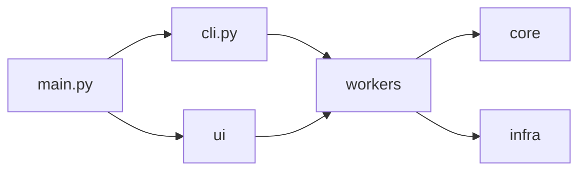
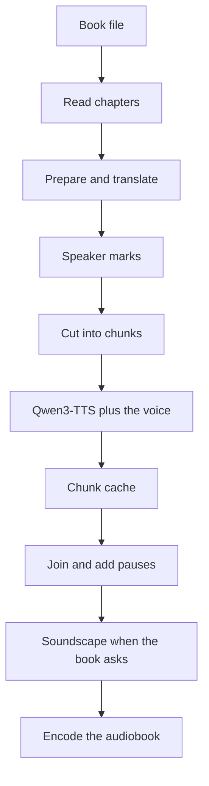

# Voxprint architecture

This document is the map of the code base: which module does what, how data flows through the application, how installation / update / model reuse work and how the UI
is wired. Read it together with the module docstrings (every module starts with one).

## Components

`main.py` starts the program. With a subcommand it hands off to `cli.py`, which calls the same runners as the windows. With no subcommand it opens the Studio. The windows live in `ui/` and do no heavy work. `workers/` runs that work on a background thread and reports progress. `core/` is the pipeline (books, text, speech, export) and does not import Qt. `infra/` is folders, downloads, the models folder, updates and platform code.



## Data flow from book to audio

A book file (TXT, Markdown, FB2, EPUB or `.vxbook`) is read into chapters. Optional preparation spells out numbers, restores Russian yo where a dictionary is sure, and can translate or rewrite the text. Optional speaker marks label each paragraph as narrator, male or female. The text is cut into sentence-sized chunks. Each chunk is spoken with Qwen3-TTS plus the chosen voice adapter, or reused from the chunk cache. Finished chunks are joined with the pause lengths, and a soundscape is mixed in only when the book asks for one. ffmpeg then writes the audiobook (Opus, MP3, M4B, FLAC or WAV).



The module-level detail of training and of narration is in the sections below.

## GPU, video memory and heat

Narration runs on the GPU. There is no CPU-only mode. Before each batch the program reads how much video memory is free and plans from that, leaving a reserve of the larger of 2 GB and 8 percent of the card. At least one chunk is always allowed. An optional cap of 70 to 80 percent of the card applies only when it is set (`gpu.vram_fraction` or `VOXPRINT_VRAM_FRACTION`); it is off by default. Running out of memory halves the batch and retries.

A long job keeps full speed for the first 2.5 hours. After that, if the median GPU temperature over the last five minutes stays at or above 83 °C, narration pauses for 2.5 minutes before the next batch group. There is no setting to turn that pause off. One job holds the shared GPU lock for its whole run so two Voxprint jobs do not load models at the same time.

A further plan, not built yet, is to place parts of these models in system memory when the card is short. It has to stay inside the reserve and the thermal pause above. See [Smart memory placement](generated/roadmap.md#smart-memory-placement) in the roadmap.

## Models folder

Heavy model files live in the models folder. The default is `%LOCALAPPDATA%\Voxprint\models` on Windows and `~/.local/share/voxprint/models` on Linux (`$XDG_DATA_HOME/voxprint/models` when that variable is set). The installer page "Models folder", `VOXPRINT_MODELS_DIR`, or the shared `models_dir` in `state/suite.json` can point somewhere else. A folder that is a Voxprint backup is restored into the normal folders; it is never used as the live models folder. Voices and settings stay beside the models folder, under the application home, not inside it.

Downloads are checked by size and SHA-256. The speech model, the aligner and the recogniser are the usual first-run set. Gemma 4 12B (GGUF) and llama.cpp live under `models/llm` and are fetched only when a text feature needs them. The soundscape model lives under `models/ace-step-1.5` and is fetched only when the soundscape is turned on. Check & repair verifies the known files and fetches a damaged one again.

## Suite command line

Other programs drive this app with the same commands the windows use: `voxprint` on Linux when the package is installed, `Voxprint.exe` on Windows, or `python main.py` from a source checkout. `--json` prints progress lines and one result object. `--dry-run` checks the inputs and the output path and does not load a model, use the GPU, or download. Exit codes are stable (0 success, 1 internal, 2 bad arguments, 3 bad input, 4 missing model, 5 out of video memory, 6 cancelled, 7 no suitable GPU). The flag list is generated from the parser: [command reference](generated/cli.md). Recipes and JSON fields: [CLI.md](CLI.md) and [AGENTS.md](AGENTS.md).

## 1. Layers

```
main.py                 entry point: user CLI (narrate/train/voices -> cli.py), maintenance flags (--selftest, --auto-repair, …), logging, start of the UI
ui/                     PySide6 windows and dialogs - no heavy work, only signals/slots
workers/                glue between UI and core: Qt threads (QThread) and Qt-free scenario runners
core/                   the pipeline itself: audio/text processing, alignment, dataset, LoRA training, export. No Qt, no installer logic
infra/                  everything around the pipeline: folders, environment probe, install state, downloads, updates, Windows glue
locales/                en.json / de.json / ru.json / uk.json / lv.json - the only place with user-visible text
credits.json, licenses/ third-party list (single source for the About dialog and THIRD_PARTY_NOTICES.md)
installer/, build.bat   PyInstaller + Inno Setup packaging
tools/                  maintenance scripts (fetch licence texts, generate notices)
tests/                  pytest suite (runs without GPU, network or models)
```
Dependencies point downwards: `ui -> workers -> core / infra`; `core` never imports `ui` or `workers`.
Root `cli.py` (next to `main.py`) is the user-facing headless CLI (`narrate` / `train` / `voices` / `speakers` / `check`); see [CLI.md](CLI.md).

## 2. Module map

### `core/`
| Module | Purpose |
|---|---|
| `types.py`, `errors.py`, `events.py` | shared dataclasses; `DatasetMakerError` hierarchy with localized messages; pipeline stages, progress callback protocol, cancellation token |
| `appinfo.py`, `i18n.py` | metadata from `credits.json`; JSON-catalog localization (`tr("key", **params)`, language detection: saved choice -> Windows locale -> English) |
| `cli.py` | developer command line for the dataset/training stages (`--fake-aligner` = dry run without a network) |
| `audio_utils.py` | reading any format (soundfile, else ffmpeg directly), resampling, WAV writing, energy / pause detection |
| `text_utils.py`, `normalizer.py` | reading the text, sentence splitting, mapping aligner words back to the text; Russian number/abbreviation normalization |
| `aligner.py` | forced alignment (`Qwen3-ForcedAligner-0.6B`, CTC backup, fake/injected aligners for tests); long audio is chunked at pauses (`align_long`, chunks <= 150 s) |
| `slicer.py`, `quality.py` | slicing on word timestamps at pauses; automatic quality filter |
| `dataset_builder.py` | writes the Alexandria-format dataset (`segment_XXX.wav`, `ref.wav`, `ref_text.txt`, `metadata.jsonl`, `report.json`) |
| `teacher_forcing.py`, `lora_trainer.py` | teacher-forced input construction; LoRA training of Qwen3-TTS-12Hz-Base (adapter, `training_meta.json`) |
| `model_export.py` | merged "universal" model (`merge_and_unload`) |
| `model_locator.py` | finds models downloaded by other apps (Hugging Face cache, Pinokio/Alexandria, ModelScope) - read-only |
| `voice_info.py` | `voice.json` (schema 3): fields, gender / age group (derived voice type), **licences** (`LICENSES`, `license_allows_commercial`, derived `commercial_use`), migration of schema 1, read/write |
| `voice_library.py` | the voice library under `voices/<id>/`: `VoiceLibrary`, `VoiceRecord`, register / import (folder, hardened zip) / update / delete / list |
| `book_parsers.py` | TXT (heading detection), FB2 (+ `.fb2.zip`, entity guard, cover), EPUB (nav / NCX / spine), `.vxbook` -> `Book` / `Chapter`; stdlib only. The `.vxbook` reader is `vxbook.py` |
| `vxbook.py` | Open a `.vxbook` ZIP (mimetype, hashes, size limits), map `book.md` / `speakers.json` / `cast.json` onto a `Book`, and keep an optional `sound.json` when extension `sound/1` is declared |
| `soundscape.py` | Plan and mix that soundscape under a finished chapter. Beds are one 45 s clip looped with a crossfade. Plain books and a `.vxbook` without `sound/1` are left alone |
| `num_words.py` | own number-to-words for Russian (cardinals, ordinals with case / gender / number, decimals) and English (cardinals, ordinals, years); no `num2words` (LGPL-2.1, no declension by suffix). Cyrillic *data* |
| `text_prep.py` | rule-based book preparation: steps `layout, noise, quotes, links, headings, numbers, abbrev, yo` (`STEP_KEYS`), `PrepOptions`, `prepare_text_block`, `prepare_book` -> `(Book, PrepReport)`, `resolve_language`; ru + en for the shared steps, `yo` for Russian only, other languages only the neutral steps |
| `yo.py` | Russian letter yo from the MIT eyo-kernel safe dictionary (`core/data/yo_safe.txt`, no download). Does not insert stress marks (the base TTS model does not read them); a yo or U+0301 the author wrote is kept |
| `text_cleanup.py` | optional neural clean-up: `CleanupEngine` protocol (`correct`), the **validator** (`validate`: only close spelling fixes, `е`->`ё`, inserted commas; everything else rejected), `BlockCache` (JSON per paragraph), `cleanup_book` (progress / cancel / resume), `SageEngine` (lazy transformers, **not run on real hardware**) |
| `book_prep.py` | `PrepPlan` (rule options + neural step keys + `engine_factory`) and `run_preparation`: rules -> clean-up -> `.debug/prepared_text.txt` + `prep_report.json` |
| `chunker.py` | chapter text -> sentence-sized chunks (reuses the clause splitter), pause lengths |
| `ordinals.py`, `ordinal_rules.py` | ordinal numbers by context before synthesis ("глава 2" -> "глава вторая", "21st", "3. Kapitel"); the rules are data ([ORDINALS.md](ORDINALS.md)) |
| `asr.py` | speech recognition interface (`Qwen3ASR`, `FakeASR`), `plausibility()` (confidence proxy), `split_at_pauses()` |
| `revoice.py` | Re-voice text path: audio files -> recognised chapters -> a `.txt` the narrator loads; Opus storage of a dictaphone recording |
| `voice_convert.py` | direct voice conversion: `VoiceConverter` protocol, `convert_file` (PCM in memory, Opus out), `make_converter` (the only place a model is chosen) |
| `vc_openvoice.py` | OpenVoice V2 implementation of that protocol (torch and the vendored package load only when a conversion starts) |
| `asr_dataset.py` | no-transcript mode: many audio files -> ASR -> gates -> the same dataset files as `DatasetBuilder` (clips are recognised individually, no forced alignment) |
| `train_presets.py` | Fast/Balanced/Maximum/Manual `TrainPlan`s on top of `plan_training`, `estimate_seconds` (4090-calibrated, scaled per GPU) |
| `consent.py` | spoken-consent templates, rule-based `parse_statement` (scope/name/date), `consent` block of voice.json, scope -> licence mapping |
| `voice_check.py` | sample quality metrics: autocorrelation F0 median, semitone distance, WER, verdict + issue codes (pitch / WER / babbling / quiet) |
| `narration.py` | `narrate_book`: `TTSEngine` protocol, `ChunkCache` (atomic per-chunk FLAC, key = sha256(engine tag + text)), `synthesize_chunks` (lazy engine, length-sorted batches re-measured from free VRAM before each group, OOM and sysmem-spill halving, thermal pause, per-chunk fallback, FLAC writer threads with a bounded queue, retry, ETA), GPU lock for the whole job, `assemble_chapters` / `_ChapterPipeline` (a chapter is joined and encoded on the CPU pool as soon as its chunks are cached), `PauseToken`, `NarrationOptions` (formats, bitrates, `allow_aac`, `preprocessors`) |
| `tts_engine.py` | the real engine `Qwen3AdapterEngine` (qwen-tts + PEFT adapter, voice-clone prompt from `ref_sample.wav`); attention backend flash-attn 2 > SDPA > eager with fallback; `synthesize_batch` / `max_batch` (batch by free VRAM); validated on an RTX 4090 |
| `audiobook_export.py` | format registry, file naming, `ffmetadata` chapters, `.m3u8`, ffmpeg command builders, encoder pre-check, `Exporter` (per-chapter encodes during synthesis, single files in parallel at the end, results in a fixed order) / `export_formats` (injectable `run`; ffmpeg at below-normal priority) |
| `cpu_budget.py` | CPU pool size and torch thread count for narration from the physical cores (`VOXPRINT_CPU_WORKERS` overrides) |
| `vram_policy.py`, `gpu_lock.py`, `gpu_thermal.py`, `sysmem_spill.py`, `fast_decode.py`, `bench.py` | VRAM rule (free memory minus `max(2 GB, 8 % of the card)`; optional 70-80 % cap, off by default); shared `voxprint-gpu.lock`; automatic cooling after 2.5 h; Windows shared-memory spill guard; optional CUDA Graphs decode via faster-qwen3-tts 0.3.x (+ tolerant RoPE init); `voxprint bench` |
| `model_cache.py` | models preloaded into RAM (`put` / `take` with ownership transfer, `take` waits for a load in progress, `to_device` for the qwen wrappers); used by `tts_engine`, `asr`, `text_cleanup` |

### `infra/`
| Module | Purpose |
|---|---|
| `paths.py` | application folders (`%LOCALAPPDATA%\Voxprint`, override `VOXPRINT_HOME`): `models/`, `packages/`, `voices/`, `state/`, `logs/`, `.staging/` |
| `projects.py` | the projects folder (`<app home>/Projects`, changeable in Settings): `Audiobooks/`, `Voices/`, `Re-voice/`; real Documents via the Known Folder API, OneDrive check, *Voxprint Projects* shortcut |
| `voice_repository.py` | online voice index (`index.json`, URL configurable, placeholder default) and verified downloads (HTTPS, size cap, SHA-256); never raises to the UI |
| `voice_catalog.py` | the voices the user sees: local library + index voices that are not installed (`repo:<id>` keys, matched by `repo_id`), `ensure_local` (download on first use), scope derived from the licence |
| `text_models.py` | registry of the on-demand text models (`TextModel`, `REGISTRY`: SAGE integrated; RUPunct, en/de spelling, stress, translation, roles = placeholders), `state()` (ready / needs_download / planned), `ensure()` (pinned revision via `model_downloader`), `make_engine`, `build_plan(rule_steps, neural_steps)` |
| `vc_model.py` | optional OpenVoice V2 converter (not in the first-run download): pins from `model_mirrors.json`, folder `models/openvoice-v2`, `ensure()` on the user's request |
| `backup.py` | backup / restore of models, the ffmpeg tool and voices: `collect_items`, `plan_backup` / `run_backup` (resumable `.part` files, manifest `voxprint-backup.json` with SHA-256, skip identical, `check_space`), `plan_restore` / `run_restore` (staging `.restoring`, hash verification, voices never overwritten); disk usage is injectable |
| `auto_repair.py` | Settings -> *Check & repair* / `--auto-repair`: `verify_install` (+ `repair_install` for a venv install), thin runtime modules, ffmpeg, then every known model file by size + SHA-256 (`model_mirrors.json`, including the tc-big translators); bad files deleted, folder -> `.partial`, `ensure_model(root=...)` completes it; then the single-file models (OpenVoice V2, DNSMOS, DeepFilterNet, Gemma GGUF + llama.cpp; Gemma is fetched only in a Full / Quick setup); `Report.summary()` |
| `existing_models.py` | the "existing models folder" (`state/existing_models_dir.txt`, env `VOXPRINT_EXISTING_MODELS`): `find` (model locator roots with `ignore_disabled`), `import_model` (hard link on the same drive, else verified copy through `<name>.importing`), `import_available`, `pending` (start-up); a Voxprint backup as source: `adopt_backup_choice` (a `models_dir.txt` that points at a backup becomes the source, the models folder goes back to the default), `backup_source`, `restore_pending`, `restore_backup` (whole backup restored once into the live folders) |
| `suite_settings.py`, `gpu_prefs.py` | `state/suite.json` shared with the Movie Dubber (`ui_language`, `theme`, `models_dir`, `gpu`); this program's GPU settings `state/gpu.json` (`vram_fraction` optional, off by default; `fast_decode`) |
| `features.py` | feature flags; today `aac_enabled()` (env `VOXPRINT_ENABLE_AAC` > `state/features.json` > `AAC_DEFAULT`) |
| `preload.py`, `sysinfo.py` | optional "Preload models into memory at startup" (`state/preload.json`, off by default): RAM need from the model files + headroom vs. total / free RAM, low-priority background loader ticked by the Studio timer, freed on low memory; physical cores, RAM, thread priority |
| `net.py` | HTTPS through the stdlib; retries with certifi roots on `CERTIFICATE_VERIFY_FAILED` |
| `platform_win.py` | OS check, dark title bar, Acrylic backdrop, process-exists check, GPU shared-memory counter via PDH / typeperf (all guarded by `sys.platform`) |
| `assets.py` | pinned non-pip assets (ffmpeg): download -> sha256 -> staging -> smoke test -> atomic swap -> rollback; ownership marker `.voxprint-owned` |
| `env_probe.py` | read-only probe of Python/torch/CUDA/packages/models and the reuse / upgrade / offer / install decision per component |
| `cuda12_libs.py` | registers the CUDA 12 cublas and cuDNN wheels before CTranslate2 is imported |
| `install_state.py` | completion manifest, health check with stable reason codes (`--verify-install`), uv-based venv plan for `--repair` |
| `model_downloader.py`, `modelscope_mirror.py`, `parallel_download.py` | model download from Hugging Face (multi-connection Range for large weights) with ModelScope / own-mirror fallbacks; post-download SHA-256 status |
| `version_manager.py`, `verified_manifest.py` | PyPI/HF version queries and comparison; the "verified by Voxprint" manifest (`verified_manifest.json`) with update channels |
| `updater.py` | check -> install into `.staging/` -> smoke test -> swap, rollback on failure |
| `vram_optimizer.py` | chooses LoRA training parameters (batch, accumulation, 8-bit optimizer, checkpointing) from the available VRAM |

### `workers/`
`pipeline_runner.py` holds the Qt-free scenarios ("dataset", "voice (LoRA)", "universal model", first-run prefetch) with injectable collaborators;
`process_worker.py` wraps them in `QThread` workers whose only interface to the UI is signals (`progress`, `finished`, `failed`, `cancelled`).
`preview_runner.py` (`run_previews`, `make_variants`, `subset`, `clips_for_time_cap`) is the Qt-free quick-preview scenario (short training on a subset + sample + metrics, injectable trainer/engine/ASR). `narration_runner.py` (`NarrationJob`, `run_narration`, `format_eta`) is the Qt-free narrator scenario; `backup_runner.py` (which repositories belong to a backup, run functions) and `backup_worker.py` (`BackupWorker`, a generic thread for backup / restore / import) serve the Settings dialog. `narrate_worker.py` has `NarrateWorker` (narration with pause / cancel) and the repository workers
(`RepoIndexWorker`, `RepoDownloadWorker`). Training registers the finished voice in the library (`pipeline_runner._register_voice`, `TaskResult.voice_id`).

### `ui/`
`studio.py` (**`StudioWindow`**: the first window, owns the other windows), `main_window.py` (the *Train your voice* window + theme constants), `voices_window.py` (*My voices*, voice cards, edit dialog, repository dialog),
`narrate_window.py` (*Narrate a book*), `revoice_window.py` (*Re-voice*: record or choose a file, then convert to text or convert the recording directly), `window_base.py` (`SubWindow`: backdrop, back button / gear, common cards), `audio_preview.py` (QtMultimedia `Previewer`), `mini_player.py` (play / pause / seek over a growing list of files; `core/play_queue.py` is its Qt-free playlist), `settings_dialog.py` (gear), `about_dialog.py`, `upgrade_dialog.py`.

## 3. Data flow of voice training
```
recording + text
   |  audio_utils.read_audio            any format -> mono float32
   |  text_utils / normalizer           clean text, Russian numbers & abbreviations "as pronounced"
   v
aligner.align_long                      forced alignment, chunks <= 150 s at pauses; text without punctuation is split into clauses <= 14 words
   v
slicer -> quality                       2-20 s clips cut at pauses; clips with problems are dropped
   v
dataset_builder                         dataset/ (Alexandria train_lora.py format) + report.json
   v
vram_optimizer -> lora_trainer          LoRA adapter (safetensors), training_meta.json, voice.json (core/voice_info.py)
   v (optional)
model_export                            merged universal model with the voice as `custom_voice`
```
Every stage reports `(stage, fraction, message)` through the progress callback and polls the cancellation token between units of work; a cancelled run leaves no half-written
result in the output folder.

## 3a. Data flow of narration
```
book file --book_parsers.load_book--> Book(chapters) --chunker.chunk_book--> chunks (sentence-sized, per chapter)
   translate.ensure_translation (optional, `NarrationOptions.translate`): Opus-MT per sentence (cache + translation_<lang>.txt in `<book> (<lang>)/`, `.translation/`) -> translated Book, target language narrated
   book_prep.run_preparation (optional, `NarrationOptions.prep`): text_prep rules -> text_cleanup (SAGE + validator, cached in .cache/cleanup.json) -> prepared Book; debug copy in .debug/
   narration.synthesize_chunks: for each chunk  cache hit?  yes -> reuse   no -> TTSEngine.synthesize_batch (or synthesize) (Qwen3AdapterEngine: base model + voice adapter + reference clip) -> ChunkCache (atomic FLAC)
   narration.assemble_chapters: stream chunks into one WAV per chapter, pauses between sentences / paragraphs, a tail after each chapter
   (chapters are joined and their per-chapter files encoded on a CPU pool while the GPU synthesizes the next ones)
   soundscape.mix_chapter_file (only when NarrationOptions.sound is set and plan_for returns a plan): cue audio, duck under speech, scale speech back to its own RMS, then encode
   audiobook_export.export_formats: ffmpeg  ->  .opus (chapters in ffmetadata)  /  per-chapter .mp3 + .m3u8  /  .m4b (AAC, only if allowed)  / ...
```
The job folder is `<output>/<book>/` with `.cache/` (chunks) and `.work/` (temporary WAVs); both are removed after success unless `keep_cache` is set. Start after a cancel / crash simply finds the cached chunks again.
Pause is a `PauseToken` polled between chunks; cancel uses the usual `CancelToken`. Before synthesis the needed ffmpeg encoders are checked so a missing `libopus` / `libmp3lame` / `aac` fails in seconds, not after hours.
The preparation stage runs inside `narrate_book` before chunking (progress phase `prepare`); exported chapter titles, metadata and the cover come from the *original* book, and the engine-side normalizer is skipped when the "numbers" step already spelled the digits out.
`.debug/` (prepared text and report) is kept after success, `.cache/` is not. The Narrate window builds the plan from its check boxes (`plan_builder`, injectable) and downloads the clean-up model through `TextModelDownloadWorker`.
Extension points: `NarrationOptions.preprocessors` (functions applied to each chunk's text - clean-up / translation) and the engine protocol (a different TTS can be injected; the tests use a fake one).

`model_downloader.ensure_model` now tries, in order: own folder -> **import from the existing models folder** (`existing_models.find/import_model`) -> read-only reuse of other programs' copies (`model_locator`) -> download. `model_locator.candidate_roots()` lists the existing folder first (kind `existing`). `main.py` runs the first-run model step also when `existing_models.pending(...)` is true, so the installer-chosen folder is imported on the first start.

## 4. Installation, environment and updates
* **Installer** (Inno Setup, per user) installs the PyInstaller `onedir` build and runs the first-start setup: environment probe, optional Python venv with the right torch build
  (`uv`), model download. Everything is recorded in the **completion manifest** (`state/`); `main.py --verify-install` re-checks it and prints stable reason codes; `--repair` rebuilds the venv.
* **Environment probe** (`env_probe`): for torch / transformers / peft / ffmpeg / models decides `reuse` (suitable and verified), `upgrade` (offer one click), `offer` or `install`.
  User environments are never modified silently - only after the one-click prompt (`ui/upgrade_dialog.py`).
* **Models**: `model_locator` finds snapshots from other apps and uses them read-only (completeness and revision checked); otherwise `model_downloader` fetches into `models/`
  (Hugging Face, falling back to ModelScope).
* **Updates** (`updater`): versions come from PyPI / the HF Hub; candidates are restricted by the verified manifest and its channel; the new package is installed into `.staging/`,
  smoke-tested (`SMOKE_CODE` in a child process) and then swapped into `packages/` (put on `sys.path` at start-up) with a backup kept for rollback.

## 5. Threading
The UI thread never blocks. A `QThread` worker runs a runner scenario; progress/finish/failure/cancel arrive as signals. Cancellation is cooperative (a token, see `core/events.py`);
the training window disables the controls that must not change while a worker runs. The Studio treats "training or narration is running" as busy: the language switch is refused meanwhile and the window titles/cards show it.
Narration and the repository dialog use their own `QThread`s (`workers/narrate_worker.py`); `StudioWindow.shutdown()` (connected to `aboutToQuit`) cancels all of them and waits.

## 6. UI structure and theme
* **Studio navigation.** `StudioWindow` is the first window. The other three windows (`MainWindow` = *Train your voice*, `VoicesWindow`, `NarrateWindow`) are separate top-level windows shown **one at a time**:
  `StudioWindow.navigate(page)` hides the current one and shows the target (geometry is carried over), every sub-window has a *← Studio* button (signal `go("studio")`), and the narrator / voices windows can jump to each other
  (*Train your voice*, *Narrate with this voice*). The trainer window is the former main window, reused unchanged except for the back button; the Studio mirrors its status and progress on the home page, and the settings
  dialog (gear) is shared. Closing any window closes the application (`shutdown()`). A 1-second timer refreshes the home cards (voice count, "no voices yet" hint).
* The training window contains the core workflow only: choose audio + text, optional voice name / type / description, one button, progress and result. Everything else lives in the
  **Settings dialog** behind the gear button: language, updates, model and data folders, repair, model preload, About. The whole content sits in a scroll area, so the window fits small screens.
* Windows 11 gets an Acrylic backdrop (`platform_win`) under a **strong dark tint**; panels and controls are solid and all text colours are opaque. The palette constants
  (`TEXT`, `TEXT_MUTED`, `CARD_GLASS`, ...) and `CONTRAST_PAIRS` live at the top of `ui/main_window.py`; `tests/test_ui.py::test_theme_contrast` checks WCAG AA (>= 4.5:1),
  also for the glass tint over a white backdrop. Without Acrylic the plain palette (`ROOT_PLAIN`, `CARD_PLAIN`) is used.
* All text goes through `tr()`; changing the language retranslates live.

## 7. File formats
**Adapter folder** (output of training): `adapter_model.safetensors`, `adapter_config.json`, `ref_sample.wav` (+ text in `training_meta.json`, used as the voice reference), `training_meta.json`, `voice.json`.

**`voice.json`** (`core/voice_info.py`, `VOICE_SCHEMA = 3`):
```json
{
  "schema": 3, "id": "anna", "name": "Anna", "language": "ru", "created": "2026-10-03T12:00:00Z",
  "duration": 1543.2, "epochs": 5, "base_model": "Qwen/Qwen3-TTS-12Hz-1.7B-Base", "author": "",
  "speaker": "", "prepared_by": "", "organization": "", "project_url": "",
  "license": "custom/personal-only", "license_url": "", "gender": "", "age_group": "", "voice_type": "",
  "description": "", "commercial_use": false
}
```
`language` is a BCP-47 code (`core/languages.py`); `gender` is `male | female` or empty, `age_group` `child | young | adult | elderly` or empty; `voice_type` (`male | female | child | other` or empty) is derived from them (child age group -> `child`, else the gender, else a stored `other`); `project_url` is http(s) only, like `license_url`; `description` has collapsed whitespace and at most 500 characters. `license` is one of `LICENSES` (CC0-1.0, CC-BY-4.0, CC-BY-SA-4.0 allow commercial use;
CC-BY-NC-4.0, CC-BY-NC-SA-4.0 and `custom/personal-only` do not); unknown or missing values become `custom/personal-only`. `commercial_use` is always recomputed from the licence when a file is read, so an imported file cannot
claim more than its licence gives. Schema 1 (`voice_name`, `speech_seconds`) and schema 2 (`voice_type` -> gender / age group, language names -> codes) are migrated on read. **Library layout:** `voices/<id>/{adapter_model.safetensors, adapter_config.json, ref_sample.wav, training_meta.json, voice.json}`.

**Repository index** (`infra/voice_repository.py`): `{"schema": 1, "voices": [{id, name, language, author, license, license_url, description, voice_type, base_model, url, sha256, size_bytes, names?, descriptions?, gender?, age_group?, speaker?, prepared_by?, organization?, project_url?}]}` (`names` / `descriptions`: optional `{ru,en,de}` maps). `tools/make_voice_package.py` also writes a Hugging Face model card (`README.md` with YAML metadata) into the package.

**Audiobook output**: see [HOW-IT-WORKS.md](HOW-IT-WORKS.md) ("Output format"); format keys and defaults are in `core/audiobook_export.py` (`DEFAULT_FORMATS = (opus_single,)`).

**Feature flag**: `aac_m4b` in `state/features.json` / `VOXPRINT_ENABLE_AAC` (`infra/features.py`). AAC is patent-encumbered; see the notice in `THIRD_PARTY_NOTICES.md`.

## 8. Testing strategy
* No test needs a GPU, a network connection or a model: aligners are replaced by `TrueRateAligner` (`tests/synth.py` synthesizes readings with a known ground truth),
  and network/process access is injected (`opener`, `run`, `which`, `runner`, `updater`).
* `tests/conftest.py` isolates app-data folders and the language for every test.
* `tests/test_i18n.py` guards the localization rules; `tests/test_credits.py` keeps `credits.json`, the notices and the installer in sync.
* The narrator is tested with a fake `TTSEngine` and a fake ffmpeg runner (`tests/test_narration.py`): chunk cache and resume, cancel / pause, ETA, chapter assembly, ffmetadata / m3u8 content, command lines, the AAC flag.
  Backup / restore / import: `tests/test_backup.py` (temporary folders, fake disk usage; cancel, resume, space, hash mismatch, hard link vs copy), `tests/test_backup_ui.py` (Settings section), `tests/test_installer_models_page.py` (lints `installer/Voxprint.iss`: encoding, message tables for en/ru/de, Pascal structure, the contract with the app; the script is never compiled on Linux). Text preparation: `tests/test_text_prep.py` (every rule step, ru + en), `tests/test_text_cleanup.py` (validator, cache / resume / cancel, registry, fake download, narration wiring), `tests/test_narrate_prep_ui.py` (the one Prepare text switch, presets, expanders, model states, speaker preview). Parsers and the chunker: `tests/test_books.py`; the library, licences and repository: `tests/test_voice_*.py`; the windows (navigation, language switch, cards, formats, disclaimer, run / pause / cancel): `tests/test_studio.py`.
* Windows-only behaviour (Acrylic, real GPU training, the real Qwen3-TTS engine, the real ffmpeg encoders) is verified manually - see [TESTING.md](TESTING.md) ("Tested on Windows").
