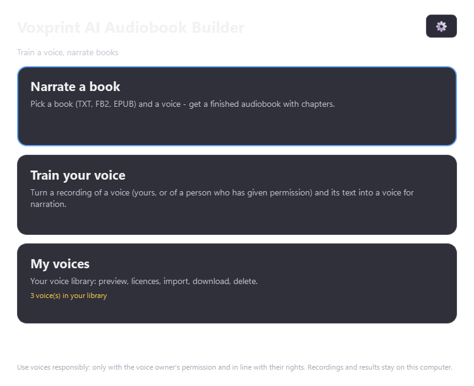
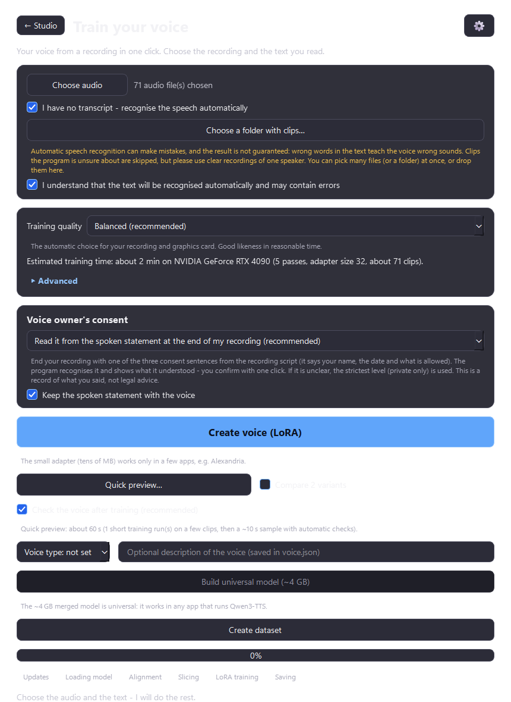
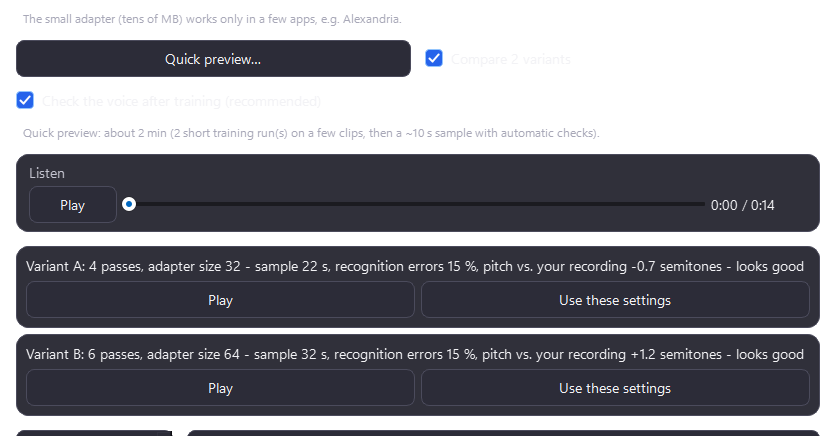
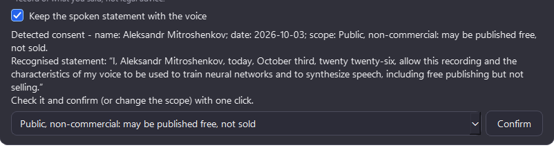
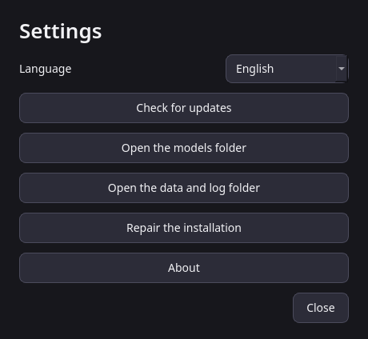

# Features and concept

The full feature list, the philosophy behind Voxprint and all screenshots. The short version is in the [README](../README.md).

## Concept and philosophy
Voxprint grew out of a search for a truly **one-button voice-cloning tool**. The tools we found needed a command line,
manual setup of components or hand-prepared files, or covered only a single step. Voxprint covers the **whole path** - from a
voice recording and a text file to ready output files you can load into a neural network. Your effort is minimal:
**read a text aloud and attach two files.**

* **One button, no expertise.** Hyper-parameters, model sizes, chunking and cleaning are chosen automatically for your GPU.
* **Economical.** Models and tools that other apps (Hugging Face cache, Pinokio/Alexandria, ModelScope) already downloaded are reused
  in place, read-only - nothing is downloaded twice, nothing of other apps is touched.
* **Honest and verifiable.** Package versions and model revisions are pinned to a "verified by Voxprint" set; failures produce stable,
  localized messages instead of tracebacks; every claim in the README and these pages is backed by a test or a documented real run.
* **Private by design.** Everything runs on your computer (see [Privacy](PRIVACY.md#privacy)).
* **Windows first**, other platforms later. Built jointly by a human and an AI - an honest attempt.

## Features
* **Studio** - the first window: three big cards (*Narrate a book*, *Train your voice*, *My voices*) and a gear button for Settings. Every other window has a *← Studio* button.
* **Narrate a book** - TXT / FB2 (also `.fb2.zip`) / EPUB parsing with chapters (pure standard library), sentence-sized chunks, synthesis
  chunk by chunk with your voice (Qwen3-TTS + LoRA adapter), progress and time left, **pause / cancel / resume** (finished chunks are kept on disk).
* **Audiobook formats** - default: **one `.opus` file with chapter markers**; **MP3 per chapter** (most compatible, ID3 tags + `.m3u8`); opt-in **M4B (AAC)** for Apple Books
  ([patent notice](AAC-M4B.md)); more under *Other formats* (M4B with Opus, Opus/FLAC/WAV per chapter, one MP3 with chapter marks). Quality is three buttons (*Compact / Standard / High*); exact bitrates sit under *Advanced*.
* **Book preparation** - fully automatic text clean-up before synthesis (no editor, nothing to review): rule-based steps for Russian and English (layout, footnotes/page numbers, quotes and dashes, links, chapter headings, **numbers in words** with Russian case/gender agreement, abbreviations) and an optional on-demand AI typo/comma fixer for Russian that is checked by a strict validator ([details](USER-GUIDE.md#prepare-the-text)).
* **Backup and restore** of models and voices to any folder or drive (resumable, skips identical files, free-space check, SHA-256 verified), an *existing models folder* that is imported before any download, and an optional installer page for it ([details](MODELS.md#backup-restore-and-existing-models)).
* **Voice library** (`%LOCALAPPDATA%\Voxprint\voices\`) - every trained voice is registered automatically; preview, licence badge, delete, **import** from a folder or a zip,
  and **download voices from a repository** (index URL is configurable; SHA-256 checked).
* **Voice licences** - each voice carries a licence (CC0, CC-BY, CC-BY-SA, CC-BY-NC, CC-BY-NC-SA or custom/personal-only) and the UI shows whether *commercial use* is allowed.
* Forced alignment of your text onto the recording with `Qwen/Qwen3-ForcedAligner-0.6B` (+ optional CTC backup aligner);
  long recordings are cut at pauses and aligned in chunks.
* Automatic **dataset in the Alexandria `train_lora.py` format**: 3-12 s clips cut at pauses (never mid-word), a clean reference
  clip, `metadata.jsonl`, a report. Bad fragments (clipping, silence, noise) are dropped automatically.
* Russian text normalization (numbers, abbreviations are spelled out) before alignment; UTF-8 / cp1251 text input; WAV, FLAC, MP3, M4A, OGG ... audio input.
* **LoRA voice training** with the Alexandria recipe (r=32, alpha=128 on the talker), parameters chosen from your VRAM
  (1.7B or 0.6B base, 8-bit Adam, CPU fallback, automatic retry plan after out-of-memory).
* Optional **universal model** (~4 GB, `custom_voice` format) merged from the adapter - works in any Qwen3-TTS app.
* **`voice.json`** next to the adapter (schema 2): id, name, language, creation date, speech duration, epochs, base model, author, licence (+ URL), voice type, description and the derived `commercial_use`.
* **Settings** dialog (gear): language (English, Deutsch, Русский), update check, model/data folders, repair, About.
* Scrollable window that stays usable on small screens (e.g. 1366x768 at 150% scaling).
* Safe self-maintenance: verified-version updates with staging + smoke test + rollback, a repair command, a completion manifest.
* Acrylic (glass) look on Windows 11 with a dark, high-contrast (WCAG AA) theme and a plain fallback.

## Screenshots
Real screenshots of the current build on **Windows (RTX 4090 server, dark theme, English UI)**; Russian and German versions of the main windows are in [`docs/screenshots/ru/`](screenshots/ru) and [`docs/screenshots/de/`](screenshots/de).

| Studio | Train: presets and the no-transcript mode |
|---|---|
|  |  |

| Train: quick preview, compare two variants | Train: voice-owner consent after training | Settings |
|---|---|---|
|  |  |  |

Russian: [`studio_home`](screenshots/ru/studio_home.png) · German: [`studio_home`](screenshots/de/studio_home.png)
Screenshots that show voice lists are not included (they would show the maintainers' private voices); the voices window and the narration window with the mini player are described in the [User guide](USER-GUIDE.md) and [Voices](VOICES.md).
